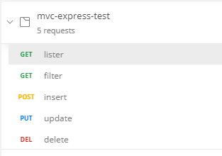
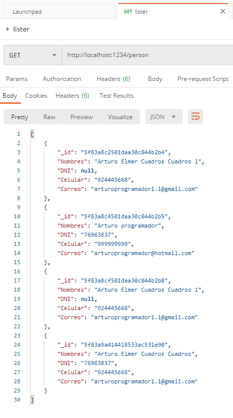
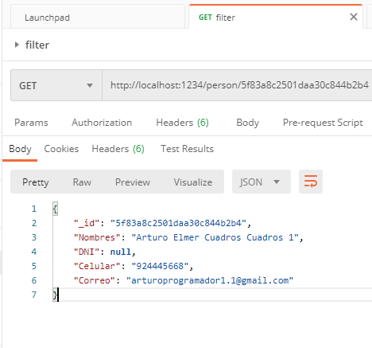
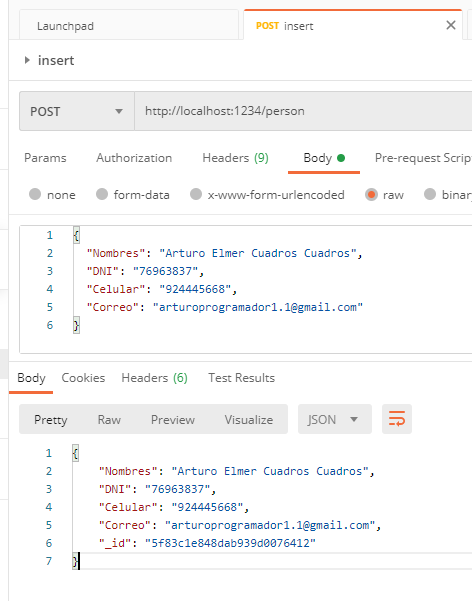
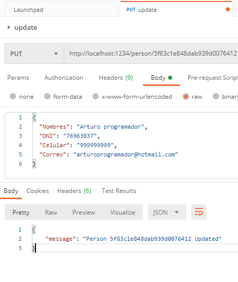
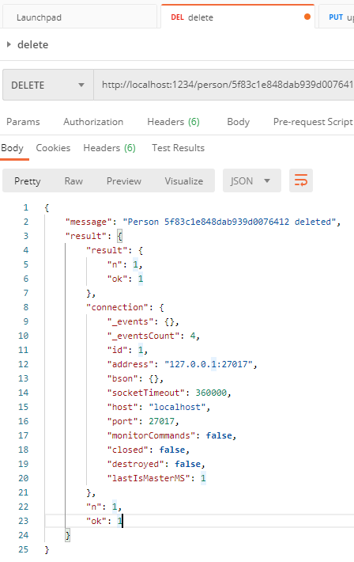

# Prueba de Backend con node
🧑💻🧑💻🧑💻🧑💻🧑💻🧑💻🧑💻🧑💻🧑💻🧑💻🧑💻🧑💻
## Breve explicación en la instalación y deploy
del principio se crea una carpeta para contener el proyecto,
donde creamos un paquete para tener las descripcion de los modulos
#
para el proyecto importaremos modulos.
#
1. [babel] (https://babeljs.io/docs/en/usage)
1. [express] (https://expressjs.com/es/)
1. [mongoDB] (https://www.npmjs.com/package/mongodb)
1. [@babel/node] (https://babeljs.io/docs/en/next/babel-node.html)
#
para inicar el proyecto de manera local, se utiliza el comando "npm run dev", donde nos permiet ubicar el index.js y se estara ejecutando el proyecto automaticamente sin necesidad de dar varias veces el comando oh se hace un cambio al proyecto.
#
para el deply el comando es [ npm run build ], donde le digo a "babel" que me conviertaen la carpeta src y cree dist, siendo un directorio del proyecto, siendo un codigo soportado actualmente
y al continuacion inciare el codigo de produccion [ npm run start ]
## Prueba de endpoint con Postman
### Carpeta que contiene los endpoint

### . Listar datos con metodo GET

### . filtar dato con metodo GET

### . insertar dato con metodo POST

### . actualizar dato con metodo PUT

### . eliminar dato con metodo DELETE

